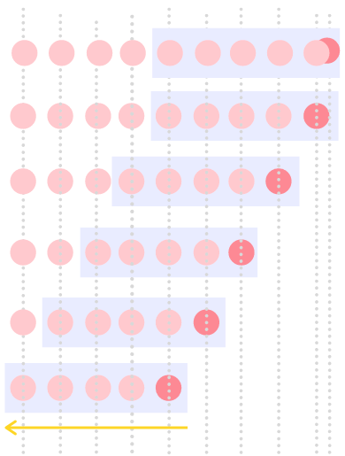

# Описание работы алгоритма
Rate Limiter регулирует количество запросов, ограничивая чрезмерное использование системы. В нашей имплиментации Rate Limiter мы использовали алгоритм Sliding Window. 
Каждый раз, когда мы получаем новый запрос, мы принимаем решение обрабатывать его или нет. Чтобы принять данное решение мы проверяем количество запросов сделанных в последние n секунд. Таким образом, процесс проверки фиксированного окна размером в n секунд на каждый запрос превращает данный подход в алгоритм Sliding Window.

## Реализация алгоритма

У нас есть:
* Класс Request, который содержит информацию о запросе (ключ и время создания запроса) 

* RequestSender - отправитель запросов. Основной функционал данной службы составляют два метода: 
    1. отправка одного запроса
    2. отправка множества запросов

* Интерфейс RateLimiter обладает двумя методами:
    1. isHandled - обрабатывает запрос и возвращает true в случае, если запрос обработан, иначе - false
    2. getServedRequests - возвращает запросы обработанные в текущем окне

* SlidingWindowRateLimiter - однопоточная реализация RateLimiter

* ThreadSafeSlidingWindowRateLimiter - многопоточная реализация RateLimiter

* Тесты однопоточной и многопоточной реализации соответственно: 
    1. SlidingWindowRateLimiterTest
    2. ThreadSafeSlidingWindowRateLimiterTest

## Однопоточная реализация

* Обработка запроса:
    1. Рассчитываем момент времени, в который было начало текущего скользящего окна. Для этого берем разность текущего времени и длительности окна.
    
    2. Подсчитываем количество запросов, которые были выполнены в рамках текущего скользящего окна, начало которого было в момент времени рассчитанный в пункте

    3. Сравниваем значение подсчитанное в пункте 2 со значением вместимости текущего скользящего окна. Если вместимость окна меньше, то добавляем новый запрос в список обработанных запросов и возвращаем true. Иначе вернется false.
    
* Подсчет количесчтва запросов, которые уже были выполнены в рамках текущего скользящего окна:
    1. Проходим по списку обработанных запросов и проверяем то, что время создания каждого запроса не выходит за рамки текущего окна. Если время создания очередного не выходит за рамки текущего окна, то увеличиваем счетчик запросов, иначе добавлчем запрос в список "устаревших" запросов. Вконце, удаляем "устаревшие" запросы из списка обработанных и возвращаем значение счетчика запросов.

## Многопоточная реализация

В отличие от однопоточного случая, в данном варианте реализации будем хранить обработанные запросы в volatile списке (это необходимо для того, чтобы сохранить возможность возвращения списка обработанных запросов)

* Обработка запроса:
    Перед началом обработки запроса мы берем блокировку. После завершения обработки запроса, отпускаем блокировку. Сама обработка запроса происходит аналогично тому, как происходит обработка запроса в однопоточном случае. С той разницей, что мы будем сохранять в атомарную переменную количество уже обработанных запросов (это необходимо, чтобы была позможность вызвать метод возвращающий данное количество)

* Подсчет количесчтва запросов, которые уже были выполнены в рамках текущего скользящего окна:
    1. Проходим по всем сохраненным запросам и увеличиваем счетчик в том случае, если время создания запроса не выходит за границы текущего скользящего окна

