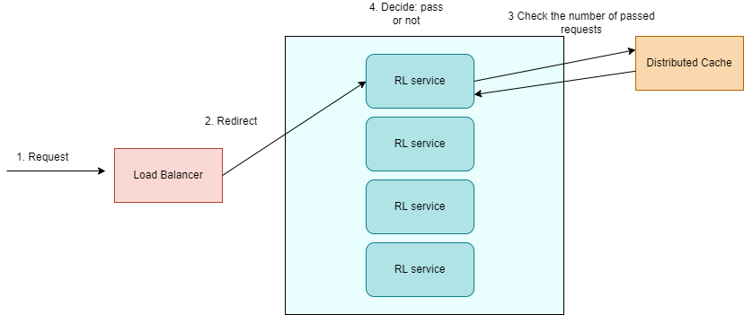

# Распределенная архитектура

Компоненты системы:
* RL service - решает, какие запросы мы будем выполнять, а какие отклоним.
* Конфигурация, где хранятся настройки рассматриваемого rate limiter.
* Балансировщик нагрузки

Рассмотрим по отдельности каждый из них.

1. Запросы при поступлении проходят через балансировщик нагрузки, который определяет, на какой сервер их отправить.
Для этого можно использовать любой алгоритм: например, самым простым вариантом будет Round Robin.

2. Конфигурация (настройки для рассматриваемого rate limiter) содержит в себе:
* количество запросов, которые могут проходить в течение одного окна (num_requests).
* длительность окна (window_time).

Конфигурацию мы можем хранить в отдельной базе данных или же на каждом из узлов отдельно. В таком случае, если в какой-то
момент мы захотим изменить один из параметров, то в каждом из этих 2 случаев произойдет следующее:
* если храним в отдельной базе данных, то в следующий раз, когда сервис будет считывать значение, он сразу применит новую
конфигурацию.

Преимущество: более актуальная информация.

Недостаток: каждый раз надо ходить в базу данных для получения параметров.

* если храним на каждом узле отдельно, то получаем сообщение и меняем настройки.

Плюс: не надо при обработке каждого запроса ходить в базу данных и смотреть параметры.

Минус: информация о смене параметров может быть получена с задержкой.

Предполагаем, что настройки Rate Limiter будут меняться нечасто, поэтому выбираем второй вариант, и будем хранить
настройки на каждом из узлов.

3. RL service - это основной компонент системы.

Каждый из сервисов при получении запроса решает: обрабатывать его или нет. Но для этого надо понять, сколько запросов
уже было обслужено в течение последнего окна (window_time) на всех узлах в кластере.

Для этого есть несколько способов:
* Отправка сообщения "каждый каждому" - это простой способ. Но минус заключается в том, что это очень долго (и кроме
того, мы также должны знать расположение всех других узлов в кластере).
* Gossip: здесь нагрузка уже меньше, но информация уже будет менее актуальной.
* Выделение лидера или же использование координатора. Лидер - это единая точка отказа. А координатор в случае скользящего
окна будет не очень эффективен.
* Распределенный кеш: выбираем именно этот способ. (Недостаток: еще одна зависимость в системе).

Таким образом, в кеше мы будем хранить информацию о последних запросах, которые были обработаны. Для каждого запроса храним:
* key
* timestamp

И когда на узел придет новый запрос, то алгоритм действий будет следующий:
* Считаем время начала текущего окна (request_timestamp - window_time).
* При помощи кеша считаем количество запросов, которые были выполнены с момента начала окна (старые запросы можно удалять).
* Принимаем решение: пропускать запрос (если число запросов не превысило допустимое значение) или нет (если превысило).
* Если решили выполнить запрос, то сохраняем данные об этом в кеше.

Общая схема выглядит так:

