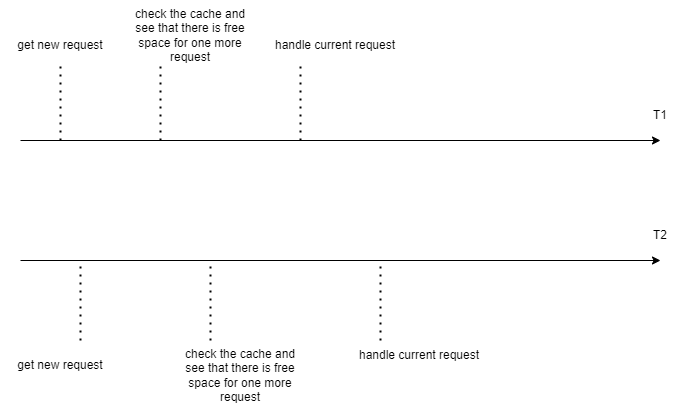

# Распределенная архитектура

Компоненты системы:
* RL service - решает, какие запросы мы будем выполнять, а какие отклоним.
* Конфигурация, где хранятся настройки рассматриваемого rate limiter.
* Балансировщик нагрузки

Рассмотрим по отдельности каждый из них.

1. Запросы при поступлении проходят через балансировщик нагрузки, который определяет, на какой сервер их отправить.
Для этого можно использовать любой алгоритм: например, самым простым вариантом будет Round Robin.

2. Конфигурация (настройки для рассматриваемого rate limiter) содержит в себе:
* количество запросов, которые могут проходить в течение одного окна (num_requests).
* длительность окна (window_time).

Конфигурацию мы можем хранить в отдельной базе данных или же на каждом из узлов отдельно. В таком случае, если в какой-то
момент мы захотим изменить один из параметров, то в каждом из этих 2 случаев произойдет следующее:

Если храним в отдельной базе данных, то в следующий раз, когда сервис будет считывать значение, он сразу применит новую
конфигурацию.

Преимущество: более актуальная информация.

Недостаток: каждый раз надо ходить в базу данных для получения параметров.

Если храним на каждом узле отдельно, то получаем сообщение и меняем настройки.

Плюс: не надо при обработке каждого запроса ходить в базу данных и смотреть параметры.

Минус: информация о смене параметров может быть получена с задержкой.

Предполагаем, что настройки Rate Limiter будут меняться нечасто, поэтому выбираем второй вариант, и будем хранить
настройки на каждом из узлов.

3. RL service - это основной компонент системы.

Каждый из сервисов при получении запроса решает: обрабатывать его или нет. Но для этого надо понять, сколько запросов
уже было обслужено в течение последнего окна (window_time) на всех узлах в кластере.

Для этого есть несколько способов:
* Отправка сообщения "каждый каждому" - это простой способ. Но минус заключается в том, что это очень долго (и кроме
того, мы также должны знать расположение всех других узлов в кластере).
* Gossip: здесь нагрузка уже меньше, но информация уже будет менее актуальной.
* Выделение лидера или же использование координатора. Лидер - это единая точка отказа. А координатор в случае скользящего
окна будет не очень эффективен.
* Распределенный кеш: выбираем именно этот способ. (Недостаток: еще одна зависимость в системе).

Таким образом, в кеше мы будем хранить информацию о последних запросах, которые были обработаны. Для каждого запроса храним:
* key
* timestamp

И когда на узел придет новый запрос, то алгоритм действий будет следующий:
1) Считаем время начала текущего окна (request_timestamp - window_time).
2) При помощи кеша считаем количество запросов, которые были выполнены с момента начала окна (старые запросы можно удалять).
3) Принимаем решение: пропускать запрос (если число запросов не превысило допустимое значение) или нет (если превысило).
4) Если решили выполнить запрос, то сохраняем данные об этом в кеше.

Общая схема выглядит так:

## Возможные проблемы

1. Первая проблема уже описывалась ранее: нам надо **уметь поддерживать общий счетчик запросов** (проходящих за одно окно)
для всех сервисов. Если подобное взаимодействие не будет корректно организовано, то может произойти ситуация, когда в
течение одного окна мы передадим больше запросов, чем указано в настройках.

Возможные варианты решения также описывались выше. Для каждого из них представлены плюсы и минусы.

| Решение  | Плюсы | Минусы |
| ------------- | ------------- | ------------- |
| Отправка сообщения "каждый каждому"  | Простая реализация. | Большая нагрузка. И необходимо знать расположение всех других узлов.  |
| Gossip  | Нагрузка меньше. И знать нужно уже не про все другие узлы. | Наличие неактуальных данных. |
| Лидер  | Быстро, актуальность достаточно высокая. | Единая точка отказа. |
| Координатор  | Похоже на лидера, но не является единой точкой отказа. | Плохо сочетается именно с алгоритмом Sliding Window. |
| Распределенный кеш | Быстро. | Надо поддерживать кеш. |

В итоге, был выбран последний алгоритм: распределенный кеш.

2. **Race Condition**. Вечная проблема распределенных систем. Представим такую ситуацию: на два узла одновременно поступили
два запроса. Оба сервиса сходили в кеш и увидели, что в текущем окне осталось место как раз для одного запроса. И оба
решили, что могут этот запрос выполнить.

Последовательность действий может быть представлена так:

В итоге, в этом окне может быть превышен лимит запросов.

Как можно решить эту проблему: самый простой способ - это ставить lock на время работы с кешем. Тогда подобных ситуаций
удастся избежать.

Альтернативой может стать lock-free algorithm. Например, пусть мы храним запросы в кеше в виде какой-нибудь последовательной
структуры (по принципу списка). Тогда при добавлении данных можно рассмотреть алгоритм с использованием compare-and-swap,
который позволит избежать явных блокировок.

Кратко рассмотрим преимущества и недостатки каждого из способов:

 Решение  | Плюсы | Минусы |
| ------------- | ------------- | ------------- |
| Lock | Простая реализация. Интуитивно более понятная. | При записи в кеш полностью его блокируем.  |
| Lock-free  | Нет явной блокировки: меньше вероятность, что какой-то поток будет долго ждать. Хотя и в этой реализации в цикле CAS он может долго крутиться. Кроме того, можем улучшить performance. | Реализация сложнее, проще ошибиться. В цикле CAS также можем находиться достаточно долго. |

Допустим, в данной архитектуре мы будем использовать алгоритм lock-free. Хотя реализация у него сложнее, но зато
может быть достигнута лучшая производительность (если у нас многоядерный процессор, то мы больше времени делаем именно
параллельные вычисления, а не последовательные).

## Оптимизация.

Возможная оптимизация - удаление "на ходу" из кеша старых значений во время добавления нового. Когда мы считаем число
запросов, которые были записаны после переданной временной метки, то при этом можем удалять те запросы, которые произошли до
нее (так как ни в это, ни в одно из следующих временных окон они все равно не попадут).

